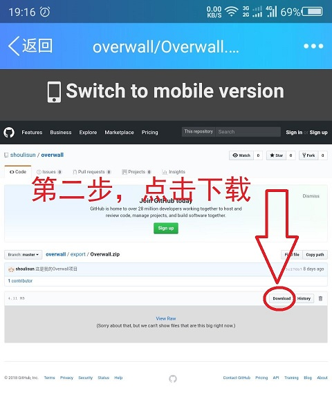

## 用户须知

-------------------------------------------------------
**新手必看Overwall使用教程**
* Overwall-PC端使用教程[戳我戳我观看视频教程](https://shoulisun.github.io/overwall/export/overwall/overwall.html)
-------------------------------------------------------
1. 最新版1.0.2下载(更新时间2018/11/28)
* Overwall网盘下载地址 [百度网盘版本1.0.2下载](https://pan.baidu.com/s/1CfIpRWK8rtRbfKBNCuLHMw)，可以复制网盘链接到浏览器下载，
* 微信扫描百度网盘二维码下载到手机然后分享到电脑，这样更方便哦
* Overwall的GitHub下载地址（点击Desktop version->点击Download） [GitHub版本1.0.2下载](https://github.com/shoulisun/overwall/blob/master/export/Overwall-1.0.2.zip)
* 更新说明：修复有线网卡BUG，修复没有有线网卡的用户的使用;优化启动界面，优化提交流程
-------------------------------------------------------------
2. 老版本版1.0.1下载
* Overwall网盘下载地址 [百度网盘下载](https://pan.baidu.com/s/1le5GChFJhxmW8kxdg9c0pg)，可以复制网盘链接到浏览器下载
* Overwall的GitHub下载地址（点击Desktop version->点击Download） [GitHub下载](https://github.com/shoulisun/overwall/blob/master/export/Overwall.zip)
-------------------------------------------------------------
### 软件功能：
* 第一、本软件提供高速网络代理，网络优化，科学上网服务。

### 使用环境：
* 第一、window7、Windows8/10，浏览器不限，下载类型不限

### 使用方法：
* 第一、直接双击打开
* 第二、点击面板的启用，第一次运行会创建您的帐户并打开此用户须知界面。到期时间自动延长1天，为试用期。
* 第三、打开浏览器，输入www.google.com访问正常，Chrome浏览器需要在浏览器设置里面关闭IE代理。
* 第四、代理模式有PAC模式和全局模式：PAC模式-自动代理，根据访问地址自动判断是否通过代理，推荐；全局模式-所有访问都通过代理，访问偏僻网站或者下载时可以尝试此项
* 第五、设置开机启动，开机启动会修改注册表，请同意；如果开机状态没联网的话，软件会启动失败，手动启动即可。
* 第六、日志会记录本机通过代理的出站和入站的流量，可以查看。
* 第七、捐赠记录会记录您提交的所有记录，包括有效的和无效的，有效的才会增加您的使用时间。如果无效记录超过4次，则用户会被禁用；一次有效捐赠即可解禁。
* 第八、关于-版权所有。
* 第九、软件会在当前目录下生成代理插件的目录\ss_win_temp，请无需理会，可以任意删除，在软件下次启动时会重新建立。若觉得文件不好看，请把软件放到其他地方，然后建立桌面快捷方式。
* 第十、软件不可以在同一目录下运行。

### 使用过程中的问题：
* 第一、第一次使用本软件请让360等安全软件允许修改IE代理。
* 第二、在有网络的情况下出现：无网络，请检查网络是否连接、获取用户失败，请稍后重试、等时，可能是服务器网络波动，请重试。
* 第三、若出现：“无法获取用户信息，请检查网络适配器”，请检查您的有线网卡是否正确安装，网卡驱动是否正常。
* 第四、本软件默认本地代理端口是1080 ，若出现端口已被占用的错误，请退出占用1080端口的程序，方法请自行百度。
* 第五、如果启用代理，发现浏览器不能访问www.google.com，请尝试修改浏览器代理设置并重启浏览器，重启软件，或更换浏览器再试
* 第六、本软件编写注重精简，注重操作方便，注重用户体验，虽然美工不太好，但实用为主，勿喷。

### 使用捐助：
* 第一、本软件保证数据传输的安全性，但不保证网络环境的安全性，所以请不要在软件代理过程中进行付款、转账等操作，损失后果自负。
* 第二、开发者开发本软件是有服务器、带宽和IP成本的，用户应适当捐助开发者，开发出更好的软件。
* 第三、本软件试用期为24小时，一月=30天，一季度=91天，半年=182天，一年=365天

### 版权和遵守：
* 第一、本软件仅供学习娱乐使用，不得私自出售、转让、传播，不得作为商业用途。
* 第二、我是“solly”，对本软件的图标，名字，源代码，软件实体，具有绝对版权，禁止任何人修改和破坏本软件，若造成软件无法使用或造成损失和不良后果请自负。
* 第三、本软件具有反编译保护，禁止使用反编译工具对本软件进行破坏。
* 第四、本软件数据传输过程完全加密，禁止使用抓包工具分析数据传输。
* 第五、如果你是专业人士，请不要绞尽脑汁了，直接联系我，我有源代码。

### 联系方式：
* 第一、如有疑问，请联系良心温柔善良帅气天赋异禀的开发者shoulisun@qq.com

### GitHub下载方法
* 手机：第一步，先点击最右下角desktop version切换到桌面版 第二步，点击download下载
* 电脑：请复制本页链接，用浏览器打开，点“GitHub下载”进去，直接点击download
